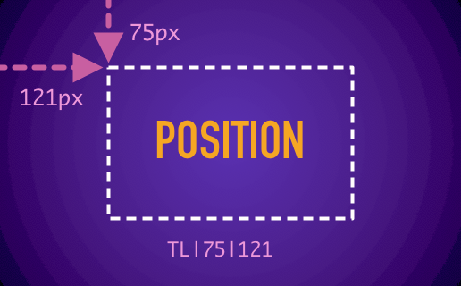

Übersicht | Position Widget
=================
:closed_book: [Übersicht Homepage](http://tracesof.net/uebersicht/)
&nbsp;&nbsp;&nbsp;:pushpin: [Übersicht Widgets](http://tracesof.net/uebersicht-widgets/)
&nbsp;&nbsp;&nbsp;:page_facing_up: [Widgets GitHub Repo](https://github.com/felixhageloh/uebersicht-widgets)

The Widget allows you to control the position and style of other [Übersicht](http://tracesof.net/uebersicht/) widgets in one place.



## Installation

Put the `Position.widget` folder into the __Übersicht Widget folder__ and edit the configuration (__config.json__). If the widget is already installed, copy all except the `config.json`.

## Configuration

For each widget id you can define a position and custom styles. The `position` can be an `object` or a `string`.

To define the position with a string, you can use the format: `<type>|<value1>|<value2>` where type is one of:

* `TL`: Top Left
* `TR`: Top Right
* `BL`: Bottom Left
* `BR`: Bottom Right
* `C`: Center

__Exemples:__

* `TL|5%|40`: 5% top and 40px left
* `BL|50|50`: Bottom 50px, Left 50px
* `C|40|0`: Top 40px centered on x axis
* `C|O|O`: Centered on screen

You can ommit the `px` for the position values.

### Styles

All other parameters in the widget definition are interpreted as styles and by default applied as __inline style__ on the widget, except keys starting with an `@` or a `_` which are excluded.

If you want to have more control and use selectors, you can apply the style as a __class__, for this just add `"@useCss": true` to the widget definition.
After that you can select and style inner elements like this: `& > div` to style `DIV` inside the widget.

The styles are only applied once at the beginning. If you update the styles, you have to reload all the widgets. You can also set `debug` to `true` to show the modifications while editing.

__Exemple configuration:__
```
{
    "@defaults": {
        "refreshFrequency": 40000,
        "debug": false
    },
    "Youtube-widget-index-coffee": {
        "@infos": "YouTube Channel Widget",
        "position": {
            "bottom": 90,
            "left": 70
        }
    },
    "github-notifications-widget-index-coffee": {
        "@infos": "Github Notifications",
        "@useCss": true,
        "position": "BL|90|120",
        "& .github-notifications": {
            "backgroundColor": "rgba(0,0,0,0.9) !important"
        }
    }
}
```

## Why this widget?

Because since the beginning the only way to change the position or styling installed widgets is by editing their scripts. Two problems with this:

* If one day the widget has updates you can unintentionally erase all of your modifications.
* To update the position, you have to open and edit each widget script individually.
